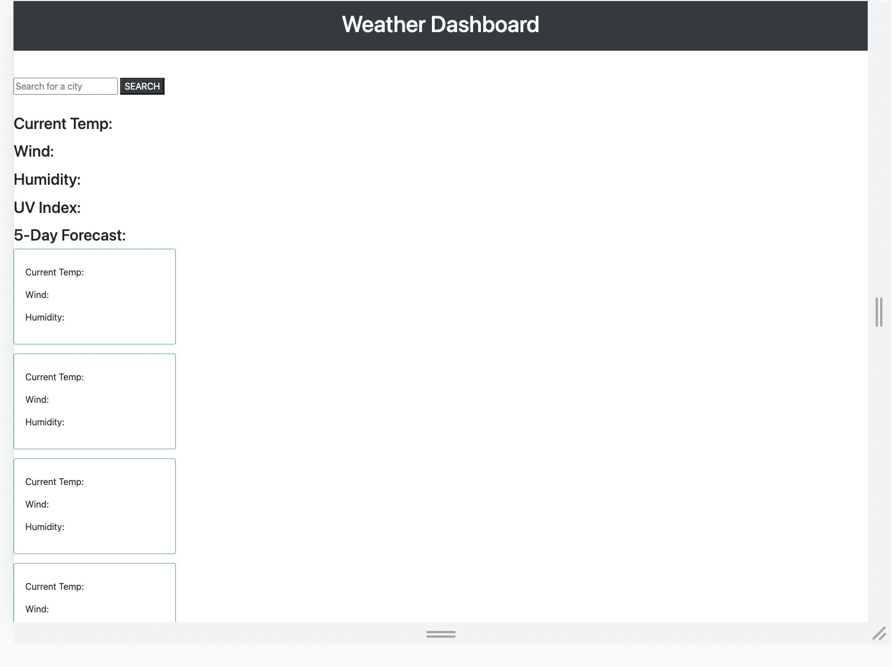

# weather-splashboard
## Description


My motivation for this project was to complete an interactive weather dashboard database where a user could enter and search any city's weather. Upon entering it would generate a 5 day forecast including a forecast for the current day above. It would show the temperature, the wind strength, humidity, and the UV Index for the current day. The website would use OpenWeather API to retrieve weather data, bootstrap as well as javascript to demonstrate full functionality. It also uses localStorage to store any persistent data. This functionable app solves any user problem's with planning a trip accordingly and packing appropriately. While I was not able to finish and have a lot of trouble with javascript hopefully can come back and update so the webpage will show full functionabilty. 


## Usage


    ```md
    
    ```

## Credits

Github: https://github.com/fcarroll12/weather-splashboard
Live deployed page: https://fcarroll12.github.io/weather-splashboard/